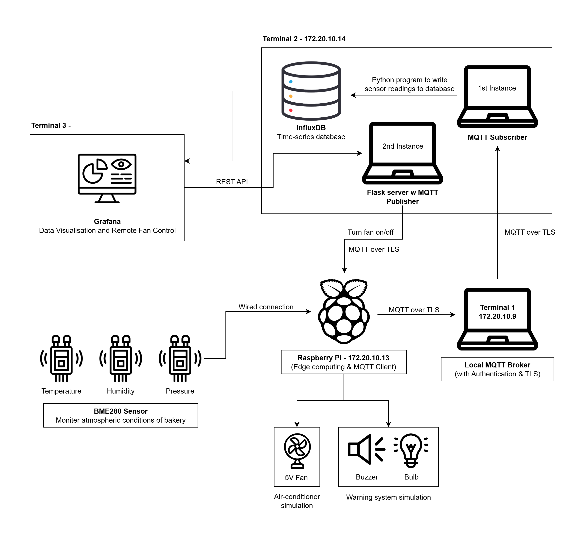

# Bakery Monitering System

## Introduction / Objectives

Our team has been tasked with developing an IoT system for a commercial bakery. 
The system will include hardware & software components, and a dashboard interface for real-time and historical data visualization. 

The primary objective of the system is to consistently monitor temperature, humidity and pressure in the bakery as well as respond automatically when parameters deviate from acceptable ranges. This is critical to ensuring quality, consistency and safety of baked goods. 

Sensor readings will be collected continuously and stored in an InfluxDB time-series database. Real-time readings and historical data can be accessed remotely via a Grafana dashboard. This will allow floor managers to closely monitor the environment in the bakery.

Temperature can affect the rate of chemical reactions during baking, directly impacting the consistency, quality and shelf life of baked goods. Inconsistent or incorrect temperatures can also lead to underbaking or overbaking.

When the temperature exceeds a set threshold, the buzzer will sound, and a warning light will begin blinking. The air-conditioning system will then be automatically activated. The warning light will turn off once the temperature drops back into the acceptable range and the air conditioning will be switched off once it returns to the minimum allowed temperature.

The real-time status and event history of the air-conditioning system will be displayed on the dashboard. Floor managers can also control the system manually via the dashboard through the integrated REST API.

Humidity can affect the texture of baked goods and is important in maintaining product consistency. Keep the humidity levels within an acceptable range also helps to prevent the growth of mould and support food safety.

In some parts of the bakery, allergens and strong spices may be used. It is important to maintain a different pressurization than that of neighbouring areas, to contain these substances and prevent cross-contamination. 

When the humidity or pressure levels exceed the set thresholds, an alert will be displayed on the dashboard. The buzzer will sound, and the light will blink 3 times to warn the floor managers. 

A prototype of this system will be built using a BME280 sensor for temperature, humidity & pressure, along with a Raspberry Pi, buzzer, an LED bulb, a 220 ohm resistor and a 5V fan with a relay to simulate the air-conditioning system. 

The system will use MQTT for communication between the Raspberry Pi and the Python program that writes the sensor readings to the database. To ensure secure data transmission, the MQTT channels will be protected using by authentication and TLS encryption.

## IoT System Architecture

#### • Terminal 1 – 172.20.10.9 / 172.20.10.4

Terminal 1 is a Windows PC that has Mosquitto installed. The private broker runs in the background as a service. The mosquitto.conf has been configured to allow communication over port 8883 with known accounts only. The private Certificate Authority certificate, server certificate and key associated with the server certificate are also specified in the config file to facilitate communications using TLS.
