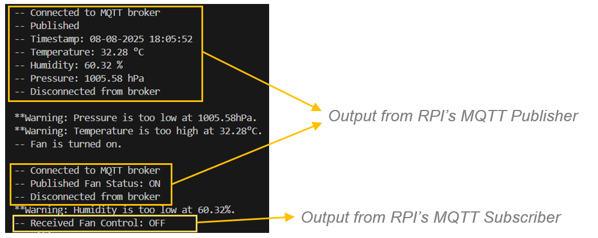
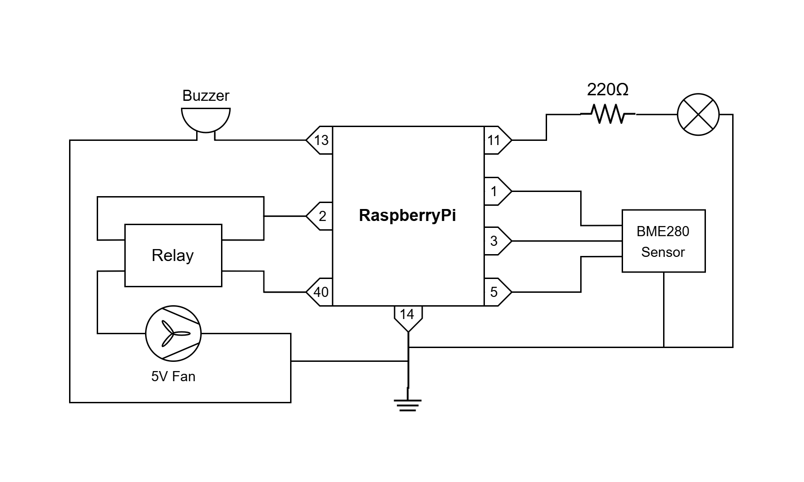

# Bakery Monitering System

## Introduction / Objectives

Our team has been tasked with developing an IoT system for a commercial bakery. 
The system will include hardware & software components, and a dashboard interface for real-time and historical data visualization. 

The primary objective of the system is to consistently monitor temperature, humidity and pressure in the bakery as well as respond automatically when parameters deviate from acceptable ranges. This is critical to ensuring quality, consistency and safety of baked goods. 

Sensor readings will be collected continuously and stored in an InfluxDB time-series database. Real-time readings and historical data can be accessed remotely via a Grafana dashboard. This will allow floor managers to closely monitor the environment in the bakery.

Temperature can affect the rate of chemical reactions during baking, directly impacting the consistency, quality and shelf life of baked goods. Inconsistent or incorrect temperatures can also lead to underbaking or overbaking.

When the temperature exceeds a set threshold, the buzzer will sound, and a warning light will begin blinking. The air-conditioning system will then be automatically activated. The warning light will turn off once the temperature drops back into the acceptable range and the air conditioning will be switched off once it returns to the minimum allowed temperature.

The real-time status and event history of the air-conditioning system will be displayed on the dashboard. Floor managers can also control the system manually via the dashboard through the integrated REST API.

Humidity can affect the texture of baked goods and is important in maintaining product consistency. Keep the humidity levels within an acceptable range also helps to prevent the growth of mould and support food safety.

In some parts of the bakery, allergens and strong spices may be used. It is important to maintain a different pressurization than that of neighbouring areas, to contain these substances and prevent cross-contamination. 

When the humidity or pressure levels exceed the set thresholds, an alert will be displayed on the dashboard. The buzzer will sound, and the light will blink 3 times to warn the floor managers. 

A prototype of this system will be built using a BME280 sensor for temperature, humidity & pressure, along with a Raspberry Pi, buzzer, an LED bulb, a 220 ohm resistor and a 5V fan with a relay to simulate the air-conditioning system. 

The system will use MQTT for communication between the Raspberry Pi and the Python program that writes the sensor readings to the database. To ensure secure data transmission, the MQTT channels will be protected using by authentication and TLS encryption.

## IoT System Architecture

#### • Terminal 1 – 172.20.10.9 / 172.20.10.4

Terminal 1 is a Windows PC that has Mosquitto installed. The private broker runs in the background as a service. The mosquitto.conf has been configured to allow communication over port 8883 with known accounts only. The private Certificate Authority certificate, server certificate and key associated with the server certificate are also specified in the config file to facilitate communications using TLS.

#### • Raspberry Pi – 172.20.10.13

The Raspberry Pi runs a Python program that fetches readings from the bme280 sensor. It then determines if the temperature, humidity and pressures are within range. If the values are out of range, the program triggers a response involving the LED bulb, buzzer and fan. 

The Raspberry Pi is both a MQTT publisher and a subscriber. It publishes a timestamp and the values from the sensor using the topics “bakery_sensor/temperature”, “bakery_sensor/humidity”, “bakery_sensor/pressure” and “bakery_sensor/timestamp”. It also uses the topic “bakery/fan_status” to publish whether the fan is currently turned on or off. This message is used to display the fan’s state is displayed on the Grafana dashboard.

The RPi subscribes to the topic “bakery/fan_control” and receives instruction to turn toggle the fan. This message originates from links on the Grafana dashboard.

#### • Terminal 2 – 172.20.10.14

This terminal is a virtual machine with Ubuntu OS. For the prototype, 2 instances of the terminal are used. 

The first instance runs a Python program that includes a MQTT subscriber. The MQTT client subscribes to the topics “bakery_sensor/temperature”, “bakery_sensor/humidity”, “bakery_sensor/pressure” and “bakery_sensor/timestamp” to receive values from the bme280 and to “bakery/fan_status” to receive the fan’s current state.

The program then proceeds to write the 3 readings (temperature, humidity and pressure) into a influxDB database “bakery” under the measurement table “bakery_environment”. It writes the fan’s state under another measurement “fan_status”. This table only contains one record which is overwritten every time as the system only displays the current state of the fan and does not require historical data.

The second instance of this terminal runs a Flask server that uses GET requests to toggle the fan. When a user clicks on either the “ON” or “OFF” link on the Grafana dashboard, a GET request is triggered, which uses a MQTT publisher to send a message with instructions to toggle the fan. The MQTT publisher uses the topic “bakery/fan_control”. 

#### • Grafana Dashboard Panels

Real-time readings and historical data can be accessed remotely via the Grafana dashboard. This allows floor managers to closely monitor the bakery environment. The dashboard also shows the real-time status of the fan (air-conditioner) and includes a control panel for its operation.

-	**Fan Status** - Displays the current operational state of the fan (ON or OFF). This allows the user to quickly verify if the fan is active without needing to physically check the hardware.

-	**Fan Control** - An interactive switch that enables the user to remotely turn the fan on or off. This can be used for manual overrides in case of automation failure or for maintenance purposes.

-	**Temperature Data** - A panel showing historical and real-time temperature readings. Data is displayed as a line graph, enabling the user to spot trends, fluctuations, and anomalies over time.

-	**Humidity Data** - Displays humidity readings over time, helping monitor environmental conditions that may affect equipment or processes.

-	**Pressure Data** - Shows the recorded air pressure levels in graphical form. Useful for identifying weather-related changes or system performance variations.

-	**Temperature Gauge** - A real-time numeric display of the latest temperature reading from the sensor.

-	**Humidity Gauge** - A real-time numeric display of the latest humidity level

-	**Pressure Stat** - A real-time numeric display of the latest pressure reading

#### • Database Schema

The system efficiently stores, queries, and analyses environmental sensor data by utilising InfluxDB, a time-series database created for high-frequency measurements. The database schema is designed to be user-friendly, scalable, and compatible with Grafana and other dashboard visualisation tools. The structure allows filtering and grouping by sensor node (nodeId) while maintaining precise timestamped temperature, humidity, and pressure values.

**Database Name:** bakery
Stores all time-series sensor data collected from the bakery environment.

**Measurement 1:** bakery_environment
Records environmental variables from the sensor.

**Tags:**  
•	nodeId (String) – Identifier of the sensor node. Currently set as "node_1".  
**Fields:**  
•	temperature (Float, °C) – Temperature reading from the sensor.  
•	humidity (Float, %) – Humidity reading from the sensor.  
•	pressure (Float, hPa) – Pressure reading from the sensor.  
**Time:**  
•	Format: nanoseconds  
•	Source: Timestamp generated when readings are received and stored.  
**Results:**  
[{"time": time.strftime("%Y-%m-%d %H:%M:%S", now),  
"measurement": 'bakery_environment',  
"tags": {"nodeId": "node_1" },  
"fields": {"temperature": temperature, "humidity": humidity, "pressure": pressure}}]  

**Measurement 2:** fan_status  
Logs the operational status of the cooling fan in the bakery.  

**Tags:**  
•	nodeId (String) – Identifier of the controller managing the fan. Currently set as "node_1".  
**Fields:**  
•	fan_status (String) – Operational state of the fan. Values: "ON" or "OFF".  
**Time:**  
•	Format: nanoseconds  
•	Source: A timestamp is recorded when the fan status is logged.  
**Results:**  
[{"time": fixed_time,  
"measurement": 'fan_status',  
"tags": {"nodeId": "node_1"},  
"fields": {"fan_status": status}}]

## Circuit Diagram of Prototype

#### Patched Circuit

## I/O pin assignment for the Raspberry Pi interface

| Pinout/Interface | Input/Output | Description                | Remarks |
|-----|------------|--------------|----------------------------|
| 1   | -          | 3.3V Power   | —                          |
| 2   | -          | 5V Power     | —                          |
| 3   | Input      | I2C          | BME280 sensor              |
| 5   | Input      | I2C          | BME280 sensor              |
| 11  | Output     | GPIO17       | Toggle LED bulb            |
| 13  | Output     | GPIO27       | Buzzer                     |
| 14  | -          | Ground       | —                          |
| 40  | Output     | GPIO21       | Toggle relay (control fan) |

## Problems Encountered / Recommendation for improvements

#### • Setting up a private MQTT broker

At first, we tried configuring and running a private MQTT broker on the Ubuntu WSL. However, we quickly learnt that the Ubuntu WSL had a different ip address from the network gateway and other terminals on the same network. This was likely due to its adapter settings and we could not figure out how to change it. ChatGPT suggested using netplan to set a new ip address but we somehow broke the virtual machine’s connectivity and were not able to restore it to its default configuration. We had to reinstall it instead. 

Next, we installed mosquitto on a host Windows PC and ran it in the background as a service. However, we could not get our MQTT client on the Raspberry Pi to connect to the broker and kept receiving errors instead. Again, we used ChatGPT to help with debugging. The ip of the Windows PC did not show up on a nmap scan. So, we switched the network from public to private under WiFi settings and this made the Windows ip visible. The MQTT client was then able to connect to the broker. 

However, we were still not able to use the Ubuntu WSL to run our program due to the unchangeable ip address. We decided to use another Ubuntu virtual machine on Oracle VM Virtual Box where we could change the adapter and the ip address would be in the same subnet.

#### • SSL error with TLS certificates

After successfully running the private broker on port 1883, we set up authentication and the required certificates for TLS encryption over port 8883. However, we encountered an error that stated the SSL certificates were self-signed and therefore, could not be trusted. As a result, no connection to the broker could be established. We tried various suggestions from ChatGPT but nothing worked. A quick Google search brought up several solutions on Stack Overflow forums but nothing worked until we found a Youtube video by a guy named Christian Lempa. He shared a detailed step-by-step guide on how to create a valid self-signed certificate. With this, the MQTT clients could establish a connection to the broker with security configuration. 

#### • Limited plug-ins on Grafana

It seemed that the version of Grafana we used for our project might have been outdated, or that many plug-ins were no longer available. We wanted to add a button on the dashboard to toggle the fan. However, there was only one plug-in available (Button Panel), and we could not get it to link to an external URL, which was required to work with the fan API. Other suggested plug-ins for this function were also unavailable, so we had to work with what was already provided. In the end, we settled on using a Text Panel, which allowed us to write HTML code for two links that would turn the fan on or off when accessed. However, the HTML seemed to have limited functionality as we could not use a HTML button. That would have been preferred for aesthetics.

